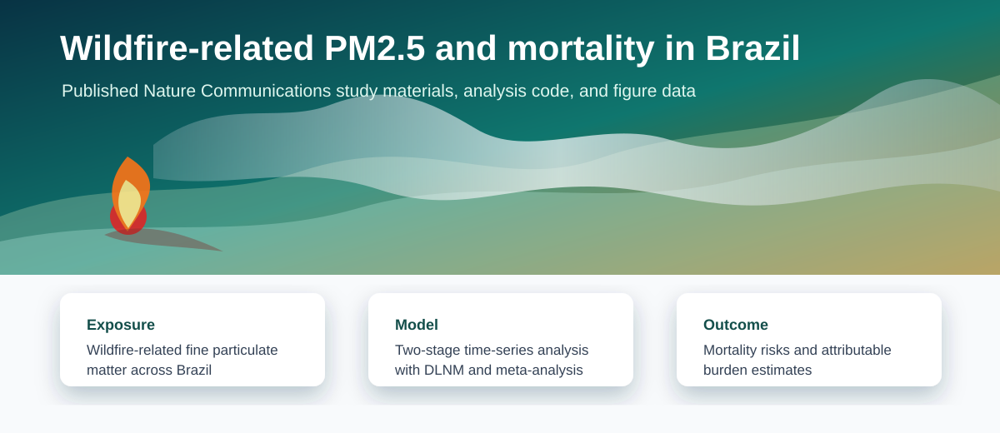
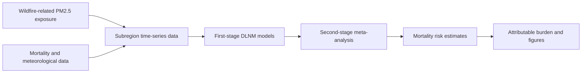

<div align="center">

# Wildfire-related PM2.5 and Mortality in Brazil

### Published analysis code and figure data for short-term fire-sourced PM2.5 mortality risks and burdens




</div>

## About

This repository provides data and main code for analyses presented in the published paper:

> Ye T, Xu R, Yue X, Chen G, Yu P, Coelho M, Saldiva PHN, Abramson MJ, Guo Y, Li S. **Short-term exposure to wildfire-related PM2.5 increases mortality risks and burdens in Brazil**. *Nature Communications*. 2022;13:7651.

The study evaluated short-term associations between wildfire-related PM2.5 and mortality in Brazil, using time-series models to estimate mortality risks and attributable burdens.

## Repository Contents

| Folder or file | Purpose |
| --- | --- |
| [`Main_model/`](Main_model/) | Main two-stage time-series modelling workflow |
| [`Sensitivity_analysis/`](Sensitivity_analysis/) | Sensitivity analysis settings and documentation |
| [`Code_for_plotting/`](Code_for_plotting/) | R code used to generate publication figure outputs |
| [`Data_for_Figures/`](Data_for_Figures/) | Prepared data files for published figures |
| [`docs/data_and_reproducibility.md`](docs/data_and_reproducibility.md) | Data and reproducibility notes |
| [`CITATION.cff`](CITATION.cff) | Citation metadata for GitHub's citation panel |

## Analysis Workflow



The core modelling approach uses:

1. subregion-specific time-series models;
2. distributed lag linear models through the `dlnm` R package;
3. quasi-Poisson regression for mortality counts;
4. confounder control for time trend, day of week, holidays, temperature, and relative humidity;
5. second-stage meta-analysis and meta-regression through the `mvmeta` R package.

## Figure Data and Plotting

| Material | Description |
| --- | --- |
| [`Data_for_Figures/data_for_Fig1.xlsx`](Data_for_Figures/data_for_Fig1.xlsx) | Prepared data for Figure 1 |
| [`Data_for_Figures/Data_fig2.rds`](Data_for_Figures/Data_fig2.rds) | Prepared data for Figure 2 |
| [`Data_for_Figures/Figure_3_data.xlsx`](Data_for_Figures/Figure_3_data.xlsx) | Prepared data for Figure 3 |
| [`Code_for_plotting/code_Figure2.R`](Code_for_plotting/code_Figure2.R) | R plotting script for Figure 2 |

## Main Model

The main analysis script is available at:

- [`Main_model/code_main_model.R`](Main_model/code_main_model.R)

It implements the first-stage and second-stage modelling structure described above. The accompanying [`Main_model/readme`](Main_model/readme) lists the core packages and methodological references.

## Sensitivity Analyses

The sensitivity analysis varied lag structure and meteorological control specifications, including:

- maximum lag time for wildfire-related PM2.5;
- degrees of freedom for lag days;
- degrees of freedom for meteorological variables;
- moving-average days for temperature.

See [`Sensitivity_analysis/readme`](Sensitivity_analysis/readme) for the repository note.

## Data Availability

This repository includes prepared figure data and analysis code, but it is not a full raw-data redistribution package. External mortality, exposure, meteorological, and geographic datasets may have separate access, licensing, and citation requirements. See [`docs/data_and_reproducibility.md`](docs/data_and_reproducibility.md).

## Citation

Please cite the published article when using this repository:

```bibtex
@article{ye2022brazilfirepm25,
  title = {Short-term exposure to wildfire-related PM2.5 increases mortality risks and burdens in Brazil},
  author = {Ye, Tingting and Xu, Rongbin and Yue, Xu and Chen, Gongbo and Yu, Pei and Coelho, Micheline and Saldiva, Paulo H. N. and Abramson, Michael J. and Guo, Yuming and Li, Shanshan},
  journal = {Nature Communications},
  volume = {13},
  pages = {7651},
  year = {2022}
}
```

## License

See [`LICENSE`](LICENSE) for repository licensing. Please also respect the data access and citation requirements of any original data providers used to reproduce the full analysis.
